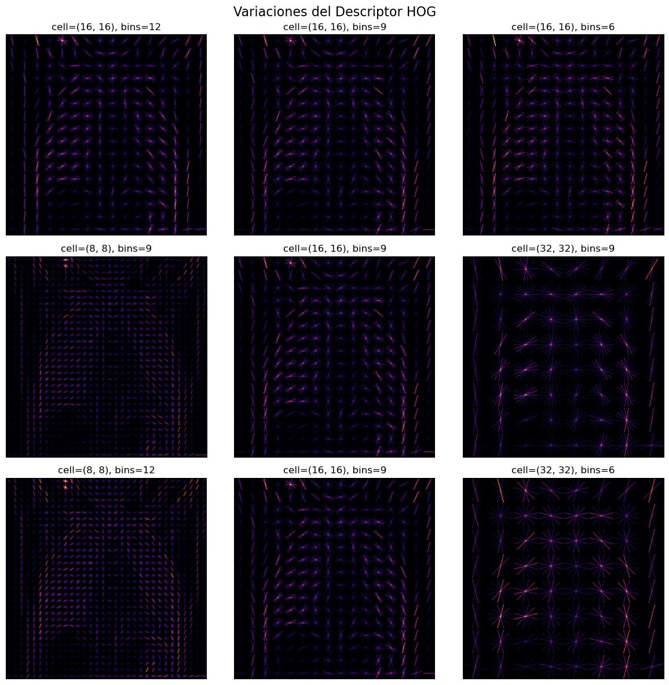
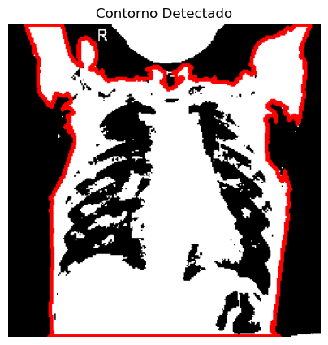
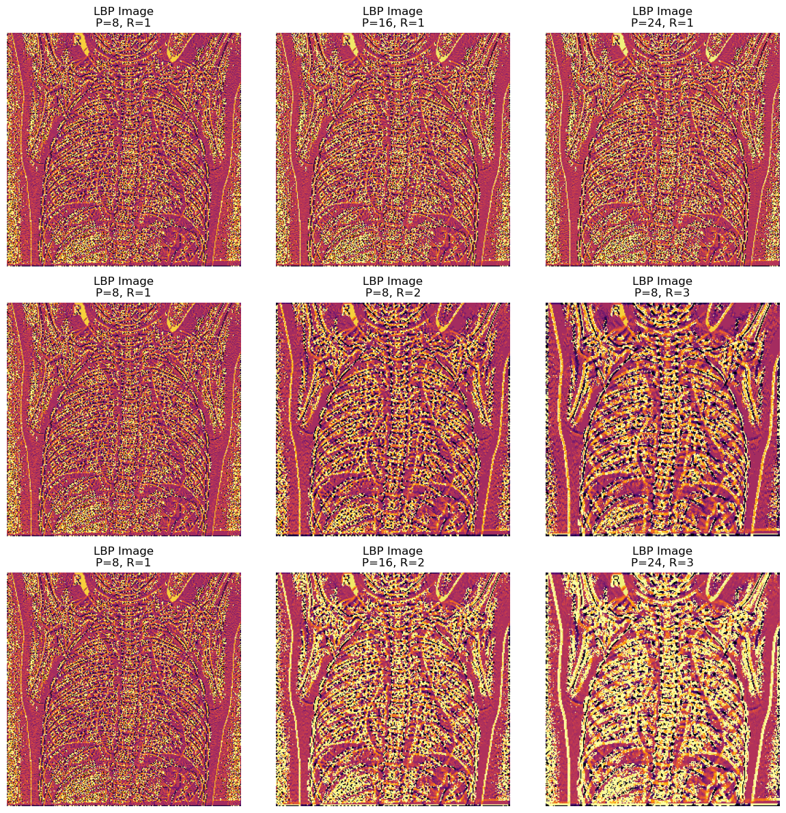
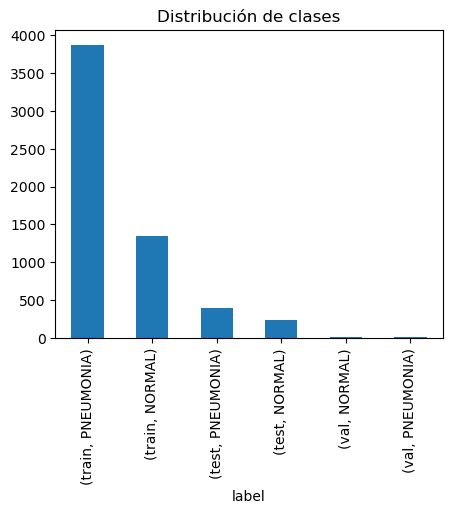
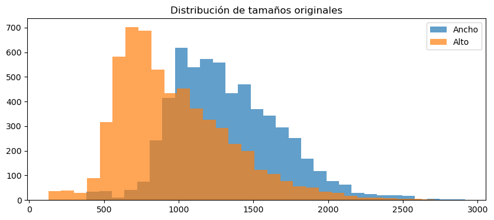
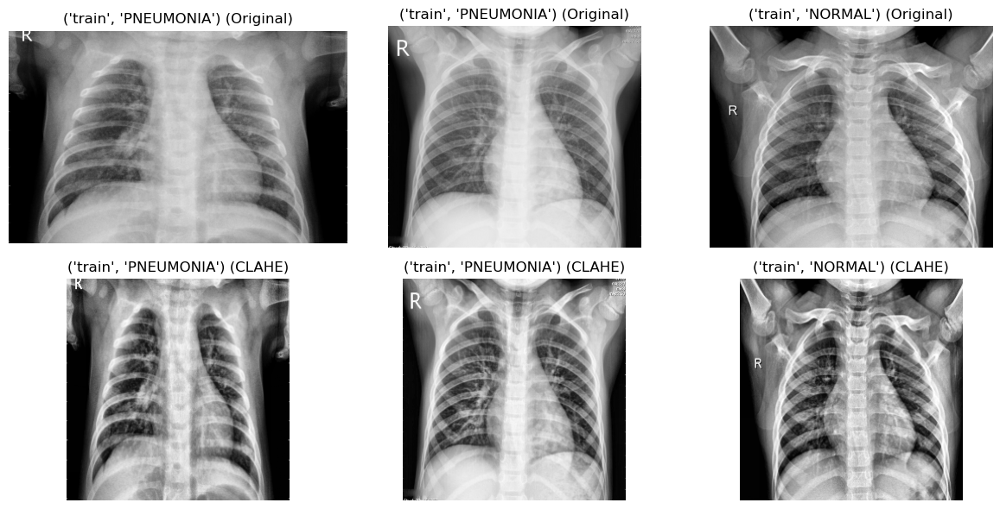
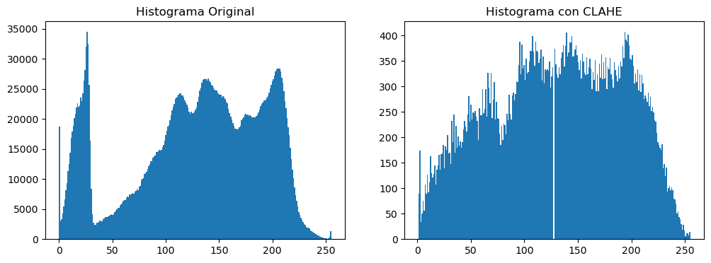
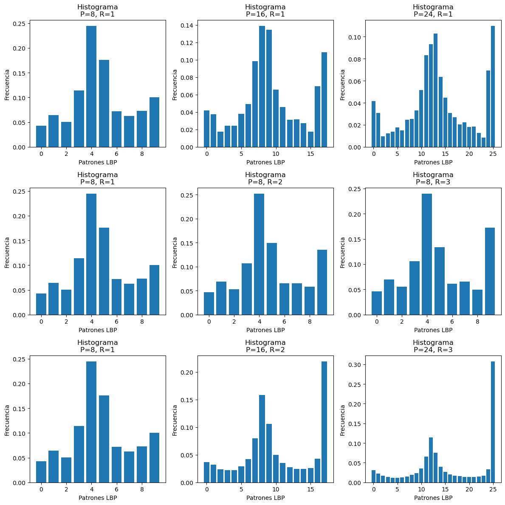
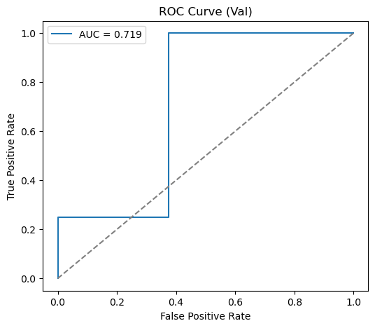
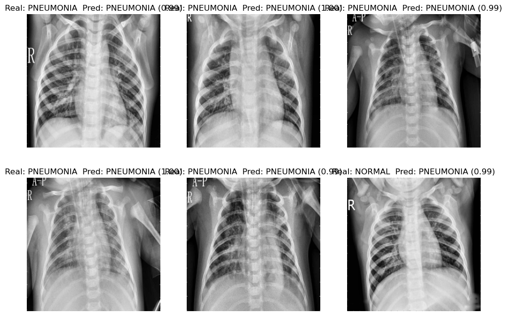

# Taller de Visión por Computador — Informe

## Estructura del informe
- [Introducción](#introducción)
- [Marco Teórico](#1-marco-teórico)
- [Metodología](#2-metodología)
- [Experimentos y Resultados](#3-experimentos-y-resultados)
- [Análisis y Discusión](#4-análisis-y-discusión)
- [Conclusiones](#5-conclusiones)
- [Referencias Bibliográficas](#6-referencias-bibliográficas)
- [Análisis de contribución individual](#análisis-de-contribución-individual)

## Introducción

Este trabajo es una práctica experimental en visión por computador aplicada al dominio médico. El objetivo general es **desarrollar y comparar sistemas de clasificación de radiografías de tórax** para distinguir entre pacientes con neumonía y pacientes sanos, utilizando dos enfoques complementarios: (1) descriptores *handcrafted* de forma y textura combinados con clasificadores tradicionales, y (2) redes neuronales convolucionales que aprenden características directamente de las imágenes.

El conjunto de datos utilizado corresponde al repositorio público *Chest X-Ray Images (Pneumonia)* disponible en Kaggle, que contiene radiografías de tórax etiquetadas como NORMAL o PNEUMONIA. A diferencia de los retos competitivos de la plataforma, **no buscamos superar el mejor modelo reportado**, sino construir un pipeline completo, reproducible y bien documentado que nos permita entender qué funciona, qué no, y por qué.

En particular, nos planteamos los siguientes objetivos específicos:

- **Explorar el dataset** mediante análisis visual y estadístico, entendiendo su distribución de clases, tamaños de imagen y calidad de los datos.
- **Diseñar y justificar un pipeline de preprocesamiento** adecuado para radiografías (normalización de tamaño, mejora de contraste con CLAHE y, opcionalmente, segmentación de región de interés).
- **Implementar descriptores clásicos de forma y textura** (momentos de Hu, descriptores de Fourier, LBP y estadísticas de primer orden), así como una combinación de ellos en un vector de características de alta dimensión.
- **Entrenar y evaluar múltiples clasificadores tradicionales** (SVM, Random Forest, k-NN, Regresión Logística) sobre estas características, incluyendo normalización, reducción de dimensionalidad y validación cruzada.
- **Entrenar y evaluar una CNN simple** sobre las imágenes originales para comparar su rendimiento frente al enfoque basado en descriptores manuales.
- **Analizar de manera crítica los resultados**, comparando métricas (Accuracy, Precision, Recall, F1, AUC), matrices de confusión e importancia de características, y discutiendo las ventajas y limitaciones de cada enfoque.

A lo largo del informe seguimos una estructura similar a la de trabajos previos del curso: primero se presenta el **marco teórico** de los métodos utilizados, luego se detalla la **metodología** (pipeline y decisiones de diseño), se reportan los **experimentos y resultados** más relevantes, y finalmente se discuten las **implicaciones, limitaciones y posibles mejoras** del sistema propuesto.

## 1. Marco Teórico

### 1.1. Descriptores de Forma

#### Momentos de Hu
Los 7 momentos de Hu son valores numéricos que representan patrones o figuras dentro de las imágenes y son invariantes a traslación, rotación y escalado (Hu, 1962). Esta propiedad permite reconocer formas sin depender de la ubicación u orientación. En nuestros experimentos, los momentos de Hu mostraron cambios muy pequeños ante transformaciones geométricas, demostrando su robustez.

#### Descriptores de Fourier
Los descriptores de Fourier (Zahn & Roskies, 1972) representan el contorno de un objeto usando una serie de Fourier. Los coeficientes iniciales representan propiedades de la forma general, mientras que los de orden superior capturan detalles más finos. Los coeficientes se normalizan para lograr invarianza a escala.

### 1.2. Descriptores de Textura

#### Local Binary Patterns (LBP)
El operador LBP (Ojala et al., 2002) deriva de la distribución de los valores de gris de un píxel central con respecto a sus vecinos. Los parámetros principales son P (número de puntos vecinos) y R (radio del círculo). Un P mayor permite capturar patrones de textura más finos, mientras que un R más pequeño implica texturas finas y un R mayor captura texturas más gruesas a mayores distancias.

### 1.3. Preprocesamiento

#### CLAHE (Contrast-Limited Adaptive Histogram Equalization)
CLAHE (Pizer et al., 1987) es una variación de la ecualización adaptativa del histograma que mejora el contraste por regiones dentro de las imágenes. Al añadir un límite a la altura del histograma, restringe el exceso de contraste en zonas homogéneas y evita ruidos excesivos. El histograma se distribuye de forma más homogénea en todo el rango de intensidades, mejorando el contraste local sin amplificar ruido.

### 1.4. Clasificadores

#### Modelos Clásicos de Machine Learning
Se evaluaron múltiples clasificadores de Machine Learning (SVM, Random Forest, k-NN, Regresión Logística) utilizando las características extraídas manualmente.

#### Redes Neuronales Convolucionales (CNN)
Las redes neuronales convolucionales fueron propuestas por LeCun et al. (1998), como LeNet-5, motivados por la tarea del reconocimiento de dígitos para automatizar la lectura de cheques bancarios basándose en una red neuronal multicapa entrenada con un algoritmo de retropropagación como aplicación del aprendizaje basado en gradientes. Este tipo de redes son especialmente útiles por su rendimiento en el aprendizaje de patrones, contornos y texturas. En este trabajo se implementó una arquitectura SimpleCNN que aprende características automáticamente a partir de las imágenes, sin necesidad de extracción manual de características.

## 2. Metodología

### 2.1. Dataset

Se utilizó el dataset Chest X-Ray Images (Pneumonia) con la siguiente distribución:
- **Conjunto de entrenamiento**: 5,216 imágenes (3,875 PNEUMONIA, 1,341 NORMAL)
- **Conjunto de validación**: 16 imágenes (8 PNEUMONIA, 8 NORMAL)
- **Conjunto de prueba**: 624 imágenes (390 PNEUMONIA, 234 NORMAL)

El dataset presenta un desbalance significativo hacia la clase PNEUMONIA, con un ratio aproximado de 2.9:1 en el conjunto de entrenamiento.

### 2.2. Preprocesamiento

1. **Redimensionamiento**: Todas las imágenes se redimensionaron a 256×256 píxeles. El análisis de tamaños originales mostró un promedio de 1327×970 píxeles y mediana de 1281×888 píxeles. La decisión de usar 256×256 se basa en el balance entre detalle y eficiencia computacional, siguiendo recomendaciones de Sabottke & Spieler (2020).

2. **CLAHE**: Se aplicó ecualización adaptativa con parámetros `clipLimit=2.0` y `tileGridSize=(8,8)` para mejorar el contraste local sin amplificar ruido.

3. **Normalización**: Las imágenes se normalizaron al rango [0, 1] dividiendo por 255.

### 2.3. Extracción de Características

Se implementaron los siguientes descriptores:

**Descriptores de Forma:**
- HOG: `pixels_per_cell=(16,16)`, `orientations=9`
- Momentos de Hu: 7 valores invariantes (Hu, 1962)
- Descriptores de Contorno: área, perímetro, circularidad, excentricidad
- Fourier: primeros 20 coeficientes (magnitudes) (Zahn & Roskies, 1972)

**Descriptores de Textura:**
- LBP: `P=8`, `R=2`, histograma de patrones (Ojala et al., 2002)
- GLCM: contraste, correlación, energía, homogeneidad
- Gabor: 3 frecuencias × 3 orientaciones × 2 estadísticas = 18 características
- Estadísticas de primer orden: 5 métricas

El vector de características total tiene aproximadamente 1,823 dimensiones.

**Visualizaciones de descriptores:**

A continuación se muestran ejemplos de la extracción de algunos descriptores clave:

**Imagen preprocesada de referencia:**

La siguiente imagen muestra la imagen de ejemplo utilizada para la extracción de descriptores, ya preprocesada con redimensionamiento y CLAHE.

**Variaciones del Descriptor HOG:**

Esta figura muestra una grilla de 3×3 con diferentes configuraciones del descriptor HOG. La primera fila varía el número de bins de orientación (12, 9, 6) manteniendo el tamaño de celda constante. La segunda fila varía el tamaño de celda (8×8, 16×16, 32×32) manteniendo 9 bins. La tercera fila muestra combinaciones de ambos parámetros. Se observa cómo celdas más pequeñas y más bins capturan detalles más finos, mientras que celdas grandes y pocos bins capturan información más global.

**Contorno Detectado:**

Esta figura muestra el resultado de la segmentación mediante umbralización de Otsu y la detección del contorno principal. El contorno detectado se dibuja en azul sobre la máscara binaria. Este contorno se utiliza para calcular descriptores geométricos como área, perímetro, circularidad y excentricidad.

**Descriptores de Fourier - Magnitudes:**

Esta gráfica muestra las magnitudes de los primeros coeficientes de los descriptores de Fourier del contorno. Los coeficientes iniciales (especialmente el primero) tienen valores altos, representando la forma general del objeto. Los coeficientes de orden superior tienden a cero, indicando que el contorno no tiene detalles finos o curvaturas complejas. El pico en el coeficiente 2 sugiere una forma elíptica o alargada.

**Variaciones de LBP - Imágenes:**

Esta grilla de 3×3 muestra las imágenes resultantes de aplicar el operador LBP con diferentes configuraciones de parámetros P (número de puntos vecinos) y R (radio). Cada imagen muestra los patrones binarios locales detectados, donde diferentes configuraciones capturan texturas a diferentes escalas: valores pequeños de R capturan texturas finas, mientras que valores mayores capturan texturas más gruesas.

**Variaciones de LBP - Histogramas:**

Esta grilla de 3×3 muestra los histogramas correspondientes a las imágenes LBP anteriores. Cada histograma representa la distribución de frecuencia de los patrones binarios locales detectados. Se observa cómo diferentes configuraciones de P y R producen distribuciones distintas, capturando diferentes aspectos de la textura de la imagen.

### 2.4. Normalización y Reducción de Dimensionalidad

1. **Normalización**: Se aplicó `StandardScaler` para estandarizar las características (media=0, std=1).

2. **PCA**: Se aplicó Análisis de Componentes Principales preservando el 95% de la varianza, reduciendo significativamente la dimensionalidad.

### 2.5. Entrenamiento y Evaluación

**Modelos Clásicos:**
- Entrenamiento en conjunto de entrenamiento normalizado y con PCA
- Evaluación en conjuntos de validación y prueba
- Validación cruzada de 5 folds para estimación robusta

**CNN:**
- Arquitectura SimpleCNN con 3 bloques convolucionales
- Entrenamiento por 50 épocas con `Adam` optimizer (lr=1e-4)
- Uso de pesos de clase para manejar desbalance
- Evaluación en conjunto de validación

## 3. Experimentos y Resultados

### 3.1. Análisis Exploratorio

**Distribución de clases:**
- El dataset está significativamente desbalanceado, con aproximadamente 2.9 veces más casos de PNEUMONIA que NORMAL en el conjunto de entrenamiento.

La siguiente figura muestra la distribución de clases en el dataset, donde se puede observar el desbalance significativo: el conjunto de entrenamiento tiene 3,875 casos de PNEUMONIA frente a 1,341 casos de NORMAL, mientras que en el conjunto de prueba hay 390 casos de PNEUMONIA y 234 de NORMAL. El conjunto de validación es muy pequeño con solo 8 casos de cada clase.

**Tamaños de imágenes:**
- Promedio: 1327×970 píxeles
- Mediana: 1281×888 píxeles
- Se decidió redimensionar a 256×256 para uniformidad y eficiencia computacional.

La siguiente figura muestra la distribución de los tamaños originales de las imágenes del dataset mediante histogramas. Se observan dos distribuciones superpuestas: una para el ancho (width) y otra para el alto (height) de las imágenes. La variabilidad en los tamaños justifica la necesidad de redimensionar todas las imágenes a un tamaño uniforme de 256×256 píxeles para el procesamiento.

**Ejemplos de imágenes de ambas clases:**

La siguiente figura muestra ejemplos de imágenes de ambas clases (NORMAL y PNEUMONIA) en dos filas: la fila superior muestra las imágenes originales tal como se encuentran en el dataset, y la fila inferior muestra las mismas imágenes después de aplicar el preprocesamiento con CLAHE. Se puede observar cómo CLAHE mejora el contraste local, haciendo más visibles las estructuras anatómicas y los patrones relevantes para la clasificación.

**Efecto del preprocesamiento (CLAHE):**

El preprocesamiento con CLAHE mejora significativamente la visibilidad de estructuras anatómicas en las radiografías. La siguiente figura compara los histogramas de intensidad de una imagen antes y después de aplicar CLAHE. El histograma original (izquierda) muestra una distribución concentrada en ciertos rangos de intensidad, mientras que el histograma después de CLAHE (derecha) muestra una distribución más uniforme a lo largo de todo el rango [0, 255], lo que indica una mejor utilización del rango dinámico y un contraste mejorado.

### 3.2. Resultados de Modelos Clásicos

Los resultados en el conjunto de **prueba** fueron:

| Modelo | Accuracy | F1-Score | Precision | Recall |
|--------|----------|----------|-----------|--------|
| **SVM-linear** | 0.7420 | 0.8282 | 0.71 | 0.99 |
| **SVM-RBF** | 0.7484 | 0.8317 | 0.71 | 0.99 |
| **Random Forest** | 0.6266 | 0.7700 | 0.63 | 1.00 |
| **kNN-5** | 0.7644 | 0.8379 | 0.74 | 0.97 |
| **LogReg** | 0.7500 | 0.8319 | 0.72 | 0.99 |

**Observaciones:**
- Todos los modelos muestran un sesgo hacia la clase PNEUMONIA (recall alto para PNEUMONIA, bajo para NORMAL)
- kNN-5 obtuvo el mejor F1-Score (0.8379) entre los modelos clásicos
- Random Forest tiene el peor rendimiento, con recall=0 para NORMAL

### 3.3. Validación Cruzada

Los resultados de validación cruzada (5-fold) en el conjunto de entrenamiento fueron:

| Modelo | F1-Score (CV) | Desviación Estándar |
|--------|---------------|---------------------|
| **SVM-linear** | 0.9828 | ±0.0045 |
| **SVM-RBF** | 0.9846 | ±0.0058 |
| **Random Forest** | 0.8570 | ±0.0018 |
| **kNN-5** | 0.9726 | ±0.0068 |
| **LogReg** | 0.9809 | ±0.0058 |

**Observación:** Los modelos muestran un rendimiento muy alto en validación cruzada (F1 > 0.98 para la mayoría), pero este rendimiento no se generaliza completamente al conjunto de prueba, sugiriendo cierto sobreajuste o diferencias en la distribución de datos.

### 3.4. Importancia de Características

**Random Forest - Top 5 características más importantes:**
- Feature 1: 0.0565
- Feature 0: 0.0541
- Feature 6: 0.0253
- Feature 2: 0.0134
- Feature 4: 0.0104

**SVM Lineal - Top 5 características más importantes:**
- Feature 6: 0.0721
- Feature 1: 0.0703
- Feature 19: 0.0614
- Feature 0: 0.0593
- Feature 4: 0.0455

**Regresión Logística - Top 5 características más importantes:**
- Feature 6: 0.4319
- Feature 1: 0.4014
- Feature 19: 0.3869
- Feature 0: 0.3344
- Feature 4: 0.2659

Las características más importantes (Features 0, 1, 4, 6, 19) corresponden probablemente a los primeros componentes principales después de PCA, que capturan la mayor varianza de los descriptores originales.

### 3.5. Resultados de CNN

En el conjunto de **validación**, la CNN obtuvo:
- **Accuracy**: 0.6875
- **F1-Score**: 0.7619
- **AUC-ROC**: 0.7188
- **Precision (NORMAL)**: 1.00
- **Recall (NORMAL)**: 0.38
- **Precision (PNEUMONIA)**: 0.62
- **Recall (PNEUMONIA)**: 1.00

El modelo CNN también muestra un sesgo hacia la clase PNEUMONIA, con recall perfecto para esta clase pero bajo recall para NORMAL.

**Matriz de confusión de la CNN:**

La siguiente matriz de confusión muestra el rendimiento de la CNN en el conjunto de validación. Los valores en la diagonal principal representan las clasificaciones correctas, mientras que los valores fuera de la diagonal representan errores. Se observa que el modelo clasifica correctamente todos los casos de PNEUMONIA (8/8), pero solo 3 de 8 casos de NORMAL, confirmando el sesgo hacia la clase mayoritaria.

**Curva ROC de la CNN:**

La curva ROC (Receiver Operating Characteristic) muestra la relación entre la tasa de verdaderos positivos (TPR) y la tasa de falsos positivos (FPR) para diferentes umbrales de decisión. El área bajo la curva (AUC) de 0.7188 indica un rendimiento moderado. La línea punteada diagonal representa el rendimiento de un clasificador aleatorio. La curva por encima de esta línea indica que el modelo tiene capacidad discriminativa, aunque limitada por el pequeño tamaño del conjunto de validación.

**Ejemplos de predicciones de la CNN:**

Esta grilla de 2×3 muestra 6 ejemplos aleatorios del conjunto de validación con sus predicciones. Cada imagen muestra la etiqueta real (Real), la predicción del modelo (Pred) y la probabilidad asignada entre paréntesis. Se puede observar visualmente casos correctamente clasificados y casos donde el modelo comete errores, lo que ayuda a entender los patrones que el modelo está aprendiendo o confundiendo.

## 4. Análisis y Discusión

### 4.1. Desbalance de Clases

El desbalance significativo del dataset (ratio ~2.9:1 PNEUMONIA:NORMAL) afecta el rendimiento de todos los modelos. Se observa consistentemente:
- **Alto recall para PNEUMONIA** (0.97-1.00): Los modelos tienden a predecir PNEUMONIA
- **Bajo recall para NORMAL** (0.00-0.41): Dificultad para identificar correctamente casos normales

Esto es crítico en aplicaciones médicas, donde los falsos negativos (clasificar PNEUMONIA como NORMAL) pueden tener consecuencias graves.

### 4.2. Comparación: Técnicas Clásicas vs Deep Learning

**Técnicas Clásicas (descriptores manuales + ML):**
- **Ventajas:**
  - Interpretabilidad: podemos analizar qué características son importantes
  - Menor tiempo de entrenamiento
  - Mejor rendimiento en este caso (F1 ~0.83 vs ~0.76)
  - Validación cruzada muestra F1 > 0.98, indicando buen ajuste a los datos de entrenamiento
  
- **Desventajas:**
  - Requieren diseño manual de características
  - El rendimiento en prueba es menor que en validación cruzada, sugiriendo sobreajuste

**Deep Learning (CNN):**
- **Ventajas:**
  - Aprende características automáticamente
  - Potencial de mejor rendimiento con más datos y épocas
  
- **Desventajas:**
  - Menor rendimiento en este caso (F1=0.76)
  - Mayor tiempo de entrenamiento
  - Menos interpretable ("caja negra")
  - El conjunto de validación es muy pequeño (16 imágenes), limitando la evaluación

### 4.3. Efecto del Preprocesamiento

El preprocesamiento con CLAHE mejora significativamente la visibilidad de estructuras anatómicas en las radiografías. La normalización y PCA son esenciales para el rendimiento de los modelos clásicos, permitiendo:
- Estandarización de escalas entre diferentes descriptores
- Reducción de dimensionalidad preservando el 95% de la varianza
- Mejora en la eficiencia computacional

### 4.4. Limitaciones

1. **Conjunto de validación muy pequeño**: Solo 16 imágenes limitan la evaluación robusta, especialmente para la CNN.

2. **Sobreajuste en modelos clásicos**: La gran diferencia entre F1 en validación cruzada (>0.98) y en prueba (~0.83) sugiere sobreajuste o diferencias en la distribución de datos.

3. **Sesgo hacia PNEUMONIA**: Todos los modelos muestran un sesgo sistemático, probablemente debido al desbalance de clases.

4. **CNN subentrenada**: 50 épocas pueden no ser suficientes para alcanzar el potencial completo de la CNN.

## 5. Conclusiones

1. **Preprocesamiento efectivo**: El pipeline de preprocesamiento (redimensionamiento a 256×256, CLAHE, normalización) prepara adecuadamente las imágenes para la extracción de características y clasificación.

2. **Descriptores clásicos competitivos**: Los modelos basados en descriptores manuales (especialmente kNN-5 y SVM) superan a la CNN simple en este caso, con F1-Score de ~0.84 vs ~0.76.

3. **Desbalance crítico**: El desbalance de clases afecta significativamente el rendimiento, especialmente para la clase minoritaria (NORMAL). Se recomienda implementar técnicas de balanceo (SMOTE, pesos de clase, oversampling).

4. **Importancia de la normalización**: La normalización y PCA mejoran significativamente el rendimiento de los modelos clásicos, reduciendo la dimensionalidad y estandarizando las características.

5. **Validación cruzada vs Prueba**: La gran diferencia entre los resultados de validación cruzada y prueba sugiere la necesidad de mejorar la estrategia de evaluación y considerar técnicas de regularización.

6. **Potencial de mejora**: La CNN podría mejorar con más épocas de entrenamiento, data augmentation, y un conjunto de validación más grande. Los descriptores de textura como LBP son particularmente útiles para radiografías.

### Recomendaciones Futuras

- Implementar técnicas de balanceo de clases (SMOTE, oversampling, pesos de clase)
- Aumentar el conjunto de validación o usar validación cruzada estratificada
- Entrenar la CNN con más épocas (50-100) y data augmentation
- Explorar arquitecturas CNN más profundas o transfer learning
- Realizar análisis de errores para identificar patrones en las clasificaciones incorrectas

## 6. Referencias Bibliográficas

Hu, M.-K. (1962). Visual pattern recognition by moment invariants. *IRE Transactions on Information Theory*, 8(2), 179–187. https://doi.org/10.1109/TIT.1962.1057692

LeCun, Y., Bottou, L., Bengio, Y., & Haffner, P. (1998). Gradient-based learning applied to document recognition. *Proceedings of the IEEE*, 86(11), 2278–2324. http://vision.stanford.edu/cs598_spring07/papers/Lecun98.pdf

Ojala, T., Pietikäinen, M., & Mäenpää, T. (2002). Multiresolution gray-scale and rotation invariant texture classification with Local Binary Patterns. *IEEE Transactions on Pattern Analysis and Machine Intelligence*, 24(7), 971–987. http://vision.stanford.edu/teaching/cs231b_spring1415/papers/lbp.pdf

Pizer, S. M., Amburn, E. P., Austin, J. D., Cromartie, R., Geselowitz, A., Greer, T., ter Haar Romeny, B., Zimmerman, J. B., & Zuiderveld, K. (1987). Adaptive histogram equalization and its variations. *Computer Vision, Graphics, and Image Processing*, 39(3), 355–368. https://doi.org/10.1016/S0734-189X(87)80186-X

Sabottke, C.F., & Spieler, B. M. (2020). The effect of image resolution on deep learning in radiography. *Radiology: Artificial Intelligence*, 2(1), e190015. https://doi.org/10.1148/ryai.2019190015

Zahn, C.T., & Roskies, R.Z. (1972). Fourier descriptors for plane closed curves. *IEEE Transactions on Computers*, C-21(3), 269–281. https://doi.org/10.1109/TC.1972.5008949

## Análisis de contribución individual

* Juan José: Desarrollo del notebook preliminar, implementación de descriptores de forma (HOG, Momentos de Hu, Contorno, Fourier), planteamiento de ideas para el análisis de resultados.

* Alexander: Desarrollo del pipeline de clasificación, implementación de descriptores de textura (LBP, GLCM, Gabor), implementación de modelos clásicos y CNN, planteamiento de ideas para el análisis de resultados. Construcción del marco teórico.

* Yuricik: Elaboración del informe, documentación de experimentos y resultados, análisis de resultados y discusión, conclusiones. Desarrollo del marco teórico.

* Thomas: Organización del repositorio, modularización de funciones, estandarización de notebooks, colaboración en la redacción del informe y publicación en GitHub Pages.

